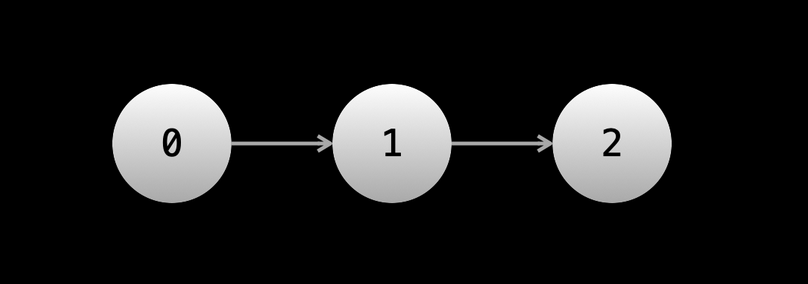

## Linked List 

Linked List is a data structure that stores data in an ordered manner implemented using node objects (custom class that defines the node object). Each node will have a next pointer that points to the node representing the next element in the sequence



To implement the above linked list in js we write the following code 

```js
class ListNode {

  constructor(val) {

    this.val = val;

    this.next = null;

  }

}

let one = new ListNode(1);

let two = new ListNode(2);

let three = new ListNode(3);

one.next = two;

two.next = three;
```

##### Advantages of Linked List compared to arrays: (Anki)

1. Add and remove elements at any position is O(1) (If we dont have reference to the node we will need to traverse to that position which takes O(n)). This is still much better than a normal (dynamic) array which requires O(n) for adding and removing from an arbitrary position
2. Linked List have the advantage of not having fixed size (While dynamic arrays can be resized under the hood they still are allocated a fixed size, when this size is exceeded the array is resized which is expensive , Linked lists dont suffer from this)

##### Disadvantages of Linked List compared  to arrays(Anki)

1. No random access
2. More overhead than arrays (Every element needs to have extra storage for the pointers)

##### **Problem 1**: Given the head of a Linked List , find the sum of all values from an integer Linked List(Anki)

```js
class ListNode {

  constructor(val) {

    this.val = val;

    this.next = null;

  }

}

let getSum = (head) => {};
```

**Solution**:

```js
class ListNode {

  constructor(val) {

    this.val = val;

    this.next = null;

  }

}

let getSum = (head) => {

  let curr = head;

  let sum = 0;

  while (curr) {

    sum += curr.val;

    curr = curr.next;

  }

  return sum;

};
```

Time Complexity : O(n)

Space Complexity : O(1)

#### **Problem 2**: Add an element to a Linked list so that it becomes the element at position i , we have the pointer to the element currently at position i-1

```js
class ListNode {

  constructor(val) {

    this.val = val;

    this.next = null;

  }

}

let addNode = (prevNode, nodeToAdd) => {}; 
```

**Solution**:

```js
class ListNode {

  constructor(val) {

    this.val = val;

    this.next = null;

  }

}

let addNode = (prevNode, nodeToAdd) => {

  nodeToAdd.next = prevNode.next;

  prevNode.next = nodeToAdd;

};
```

Time Complexity : O(1) [ here we are given the reference to prevNode so O(1) , if we were not given reference to prevNode then O(N) ]

Space Complexity : O(1)

##### **Problem 3**: Delete an element of a Linked List at position i , we have the pointer to the element at position i-1(prevNode)

```js
class ListNode {

  constructor(val) {

    this.val = val;

    this.next = null;

  }

}

let deleteNode = (prevNode) => {};
```

**Solution**:

```js
class ListNode {

  constructor(val) {

    this.val = val;

    this.next = null;

  }

}

let deleteNode = (prevNode) => {

  prevNode.next = prevNode.next.next;

};
```

